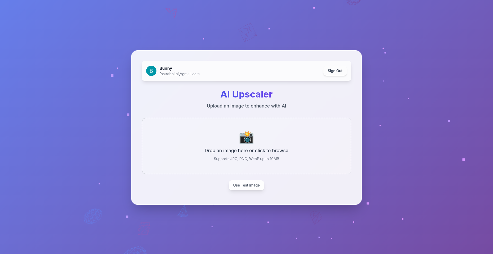
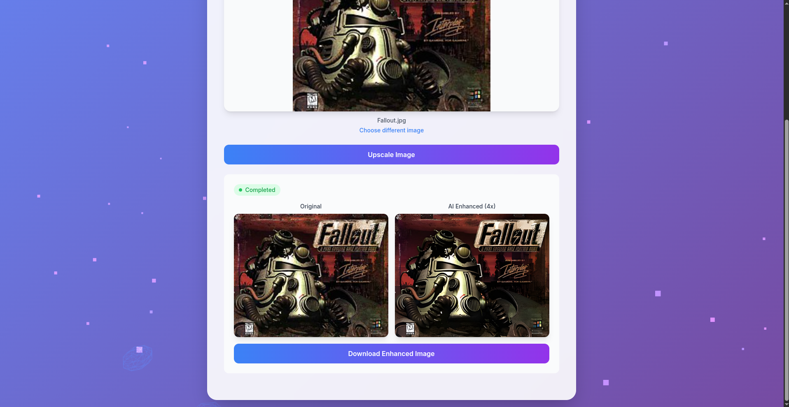

# RabbitAI - AI Image Upscaler

> **🤖 AI-Authored Project**: This entire project was created as an experiment to test the capabilities of AI in full-stack software development, using **Augment AI** as the primary development assistant.

A modern, scalable AI-powered image upscaling service built with Real-ESRGAN, featuring a React frontend, FastAPI backend, and cloud-native architecture.

## 📸 Screenshots

### Application Interface

*Modern React frontend with Apple-inspired design and drag & drop functionality*

### AI Upscaling Results

*Real-ESRGAN 4x upscaling with real-time progress tracking*

## 🎯 Project Overview

RabbitAI demonstrates how AI can author complete software projects, from architecture design to deployment. This image upscaling service showcases:

- **Real-ESRGAN Integration**: State-of-the-art AI upscaling with 4x enhancement
- **Microservices Architecture**: Decoupled API and processing services
- **Async Processing**: Queue-based job processing with real-time status updates
- **Cloud-Native Design**: Docker containers, AWS deployment, monitoring stack
- **Modern Frontend**: React with Tailwind CSS and real-time progress tracking

## 🏗️ Architecture

```
┌─────────────────┐    ┌─────────────────┐    ┌─────────────────┐
│   React Frontend │    │  FastAPI Gateway │    │ Upscaler Service │
│   (Port 3000)   │◄──►│   (Port 8080)   │◄──►│   (Port 8083)   │
└─────────────────┘    └─────────────────┘    └─────────────────┘
         │                       │                       │
         │              ┌─────────────────┐              │
         │              │    RabbitMQ     │              │
         └──────────────┤   (Port 5672)   ├──────────────┘
                        └─────────────────┘
                                 │
                    ┌─────────────────┐    ┌─────────────────┐
                    │      Redis      │    │   AWS S3/       │
                    │   (Port 6379)   │    │   LocalStack    │
                    └─────────────────┘    └─────────────────┘
```

## 🚀 Quick Start

### Prerequisites
- Docker & Docker Compose
- Node.js 18+ (for frontend development)
- AWS CLI (for cloud deployment)

### Local Development

1. **Clone and start services**:
```bash
git clone <repository-url>
cd rabbitai
make up
```

2. **Alternative: Development with hot reload**:
```bash
# Start services with file watching for development
make watch

# Or manually setup LocalStack if needed
./scripts/setup-localstack.sh
```

3. **Access the application**:
- Frontend: http://localhost:3000
- API: http://localhost:8080
- RabbitMQ Management: http://localhost:15672 (admin/admin123)
- Grafana: http://localhost:3001 (admin/admin123)

4. **Test the API**:
```bash
make test
```

### Development Workflow Examples

**Start development environment:**
```bash
# Full development setup with hot reload
make watch

# Check service URLs
make urls

# View logs in real-time
make logs
```

**Frontend development:**
```bash
# Install frontend dependencies
make frontend-install

# Start frontend in development mode
make frontend-dev

# Build frontend for production
make frontend-build
```

**Testing and debugging:**
```bash
# Test API endpoints
make test

# Test file upload with sample image
make test-upload

# Debug Grafana dashboards
make grafana-debug

# Check metrics endpoints
make metrics-debug
```

**Clean up:**
```bash
# Stop all services
make down

# Clean up containers and volumes
make clean
```

### Available Commands

```bash
make up          # Start all services
make down        # Stop all services
make watch       # Start with hot reload (development)
make logs        # View logs
make test        # Test API endpoints
make clean       # Clean up containers and volumes
make urls        # Show all service URLs
make frontend-install    # Install frontend dependencies
make frontend-dev       # Start frontend development server
make grafana-debug      # Debug Grafana configuration
make metrics-debug      # Check metrics endpoints
```

## 🔧 Services

### Frontend (React + Tailwind)
- Modern, responsive UI with Apple-inspired design
- Real-time progress tracking with WebSocket-like polling
- Drag & drop file upload
- Image preview and download functionality

### AI Upscaler API (FastAPI)
- RESTful API for image upload and job management
- Async job queuing with RabbitMQ
- S3 integration for file storage
- Prometheus metrics and health checks

### Upscaler Service (Python + Real-ESRGAN)
- Background processing service
- Real-ESRGAN AI model integration
- Thread pool for CPU-intensive tasks
- Progress tracking and error handling

### Infrastructure
- **RabbitMQ**: Message queuing for async processing
- **Redis**: Job status caching and session storage
- **LocalStack**: Local AWS services simulation
- **Prometheus + Grafana**: Monitoring and observability

## 🌐 Cloud Deployment

### AWS Infrastructure (Terraform)

```bash
cd terraform
terraform init
terraform plan
terraform apply
```

**Deployed Resources**:
- ECS Fargate services
- Application Load Balancer
- S3 buckets for storage
- RDS for persistent data
- ElastiCache Redis cluster
- CloudWatch monitoring

### Manual Deployment

```bash
# Set environment variables
export AWS_ACCOUNT_ID=your-account-id
export AWS_REGION=us-east-1

# Deploy to AWS
./deploy.sh
```

## 📊 Monitoring

The project includes comprehensive monitoring:

- **Grafana Dashboards**: Real-time metrics and system health
- **Prometheus Metrics**: API performance, queue depth, processing times
- **Health Checks**: Service availability monitoring
- **Logging**: Structured logging across all services

## 🧪 Testing

### API Testing
```bash
# Health check
curl http://localhost:8080/health

# Upload test image
curl -X POST "http://localhost:8080/upscale" -F "file=@test.jpg"

# Check job status
curl http://localhost:8080/status/{job_id}
```

### Load Testing
```bash
# Install dependencies
pip install locust

# Run load tests
locust -f tests/load_test.py --host=http://localhost:8080
```

## 🤖 AI Development Process

This project was created entirely through AI assistance using **Augment AI**, demonstrating:

### What AI Successfully Authored:
- ✅ **Architecture Design**: Microservices, message queues, cloud infrastructure
- ✅ **Full-Stack Development**: React frontend, FastAPI backend, Python services
- ✅ **DevOps**: Docker containers, Terraform IaC, deployment scripts
- ✅ **Monitoring**: Prometheus metrics, Grafana dashboards
- ✅ **Documentation**: API docs, deployment guides, troubleshooting

### AI Development Workflow:
1. **Requirements Gathering**: AI helped define project scope and architecture
2. **Technology Selection**: AI recommended optimal tech stack for the use case
3. **Implementation**: AI wrote code for all components iteratively
4. **Integration**: AI resolved service communication and data flow issues
5. **Deployment**: AI created cloud infrastructure and deployment automation
6. **Optimization**: AI identified and fixed performance bottlenecks

### Key AI Capabilities Demonstrated:
- **Context Awareness**: Understanding complex multi-service architectures
- **Problem Solving**: Debugging integration issues and performance problems
- **Best Practices**: Following industry standards for security, scalability
- **Documentation**: Creating comprehensive technical documentation

## 🔍 Technical Highlights

### Performance Optimizations
- **Tiled Processing**: Real-ESRGAN processes large images in chunks
- **Thread Pools**: Non-blocking CPU-intensive operations
- **Caching**: Redis for job status and session management
- **CDN Ready**: S3 integration with CloudFront support

### Security Features
- **CORS Configuration**: Secure cross-origin requests
- **Input Validation**: File type and size restrictions
- **Error Handling**: Graceful failure modes and user feedback
- **Health Checks**: Service availability monitoring

### Scalability Design
- **Horizontal Scaling**: Stateless services with load balancing
- **Queue-Based Processing**: Decoupled async job processing
- **Cloud-Native**: Container-based deployment with auto-scaling
- **Monitoring**: Comprehensive observability for production use

## 📝 API Documentation

### Endpoints

| Method | Endpoint | Description |
|--------|----------|-------------|
| GET | `/health` | Service health check |
| POST | `/upscale` | Upload image for upscaling |
| GET | `/status/{job_id}` | Get job processing status |
| GET | `/download/{job_id}` | Download upscaled image |
| GET | `/metrics` | Prometheus metrics |

### Example Usage

```javascript
// Upload image
const formData = new FormData();
formData.append('file', imageFile);

const response = await fetch('/upscale', {
  method: 'POST',
  body: formData
});

const { job_id } = await response.json();

// Poll for completion
const checkStatus = async () => {
  const status = await fetch(`/status/${job_id}`);
  const { status: jobStatus, progress } = await status.json();
  
  if (jobStatus === 'completed') {
    const download = await fetch(`/download/${job_id}`);
    const { download_url } = await download.json();
    // Use download_url to get the upscaled image
  }
};
```

## 🤝 Contributing

This project serves as a demonstration of AI-assisted development. Contributions are welcome to:

- Improve AI model performance
- Add new upscaling algorithms
- Enhance monitoring and observability
- Optimize cloud infrastructure costs

## 📄 License

MIT License - See [LICENSE](LICENSE) file for details.

## 🙏 Acknowledgments

- **Augment AI**: Primary development assistant that authored this project
- **Real-ESRGAN**: AI upscaling model by Tencent ARC Lab
- **FastAPI**: Modern Python web framework
- **React**: Frontend framework
- **AWS**: Cloud infrastructure platform

---

> **Note**: This project demonstrates the current capabilities and limitations of AI in software development. While AI successfully authored the majority of the codebase, human oversight was essential for project direction, testing, and deployment validation.

